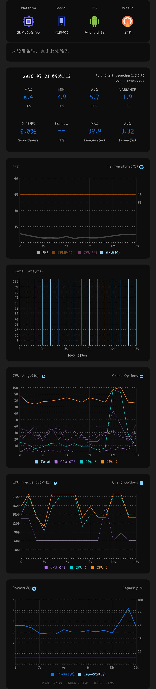
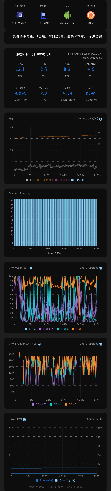
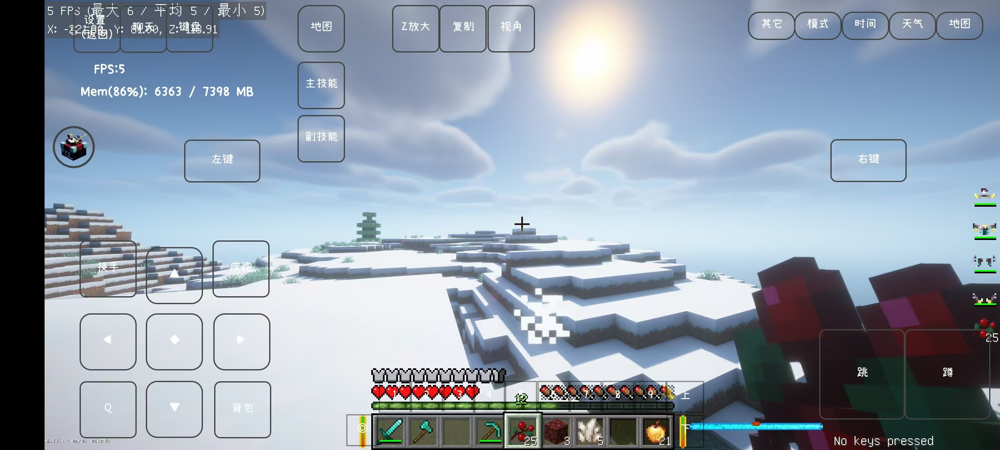

# 移动端MC Java版“混沌特调”实验报告  
关于调度欺骗与驱动崩溃的记录  
# 即尝试通过降频与内存压力欺骗安卓调度器以提升旧机型帧率，最终因Vulkan驱动边界条件触发导致环境崩坏的实验记录。  
[实验详细流程](docs/experiment_details.md)

## 项目简介  
本项目通过“混沌特调”策略（降频+内存压力），探索安卓设备上Minecraft Java版的性能极限，记录了从“卡顿崩溃”到“极限流畅”的过程，并分析底层驱动崩溃风险。  

## 实验环境  
- 设备：OPPO Reno3Pro PCRM00 (SDM765G 5G, Android 12)  
- 启动器：Fold Craft Launcher (1.3.1.9)  
- 光影包：BSL（全低预设，后期ultra预设）、Photon（前期）  
- 监控工具：scene  
- 游戏版本:1.20.1  

## 实测数据：性能监控图表对比  
- 前期（未干预）缺少统计数据，但有测试视频，平均约为3.0左右  
- 中期1 (BSL光影，开始干预)   
  - FPS: 平均5.7，帧时间最大517ms，CPU大核波动剧烈。  
- 中期2:   
  - FPS: 平均8.2，帧时间最大573ms，CPU大核高频运行。  
- 后期 (混沌特调) :   
  - FPS: 平均9.0关闭录屏有10+，帧时间最大367ms，CPU大核稳定运行。  

## 极限性能展示：高帧率演示  
- 对比：从“严重卡顿”到“比较丝般顺滑”  
  | 阶段       | 截图                          | FPS (平均) |  
  |------------|-------------------------------|-------------|  
  | 前期 (未干预) |  | 3.0         |  
  | 极限 (特调后) |  | 15          |  

## 结论  
1. “混沌特调”在BSL光影下将平均FPS从3.0提升至9.0甚至10+，最高FPS15，高帧率截图进一步证明极限效果。  
2. 温度仅小幅上升（+3.8℃），说明降频策略平衡了性能与发热。  
3. 后期驱动崩溃提示底层风险，异常红屏黑屏，手机触屏疑似出现问题，vulkan驱动异常，需谨慎使用此类优化。  

## 附录  
- 实验视频（在极限高压性能环境录屏会不可避免的降低帧数）：  
  - [早期Photon光影卡顿](assets/videos/早期测试photon光影.mp4)  
  - [中期BSL光影测试](assets/videos/中期测试.mp4)  
  - [后期测试1](assets/videos/后期测试1.mp4)  
  - [后期测试2](assets/videos/后期测试2.mp4)  
